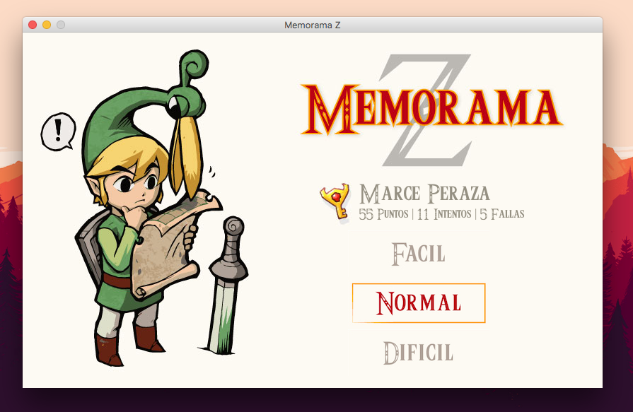
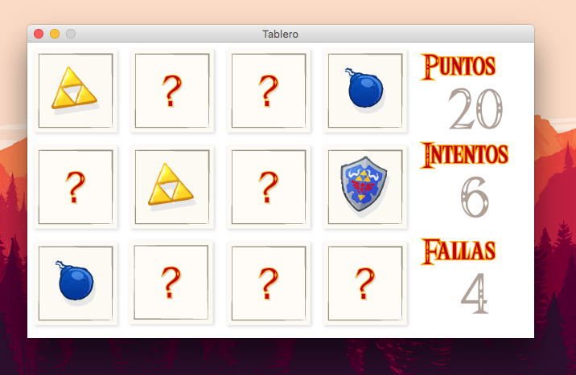
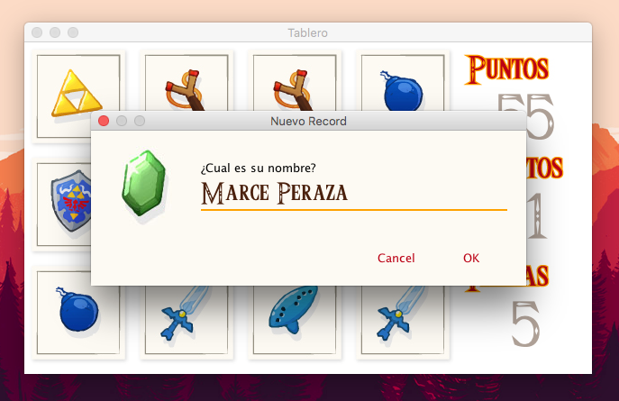

# Proyecto MemoramaZ

Este proyecto fue desarrollado con fines educativos, bajo ninguna licencia, sin motivo o fines de lucro.
Con la colaboracion y participación de Marcela Peraza y Jose Salinas.

## Uso del binario

Se compilo un archivo binario `./build/MemoramaZ.jar` que puede ser ejecutado de forma universal, sus requisitos son tener una version actualizada de [Java Runtime SE](http://www.oracle.com/technetwork/java/javase/downloads/jre8-downloads-2133155.html).

## Codigo fuente

Solamente se utilizo [Sublime Text 3](https://www.sublimetext.com/) y la Terminal para este desarrollo, todo esta incluido en el folder `./src/`, el codigo puede ser compilado sin problemas (es nuestra mejor recomendación) con [IntellJ IDEA](https://www.jetbrains.com/idea/).

## Interfaz

### Intro del juego

### Tablero del juego

### Record Screen

